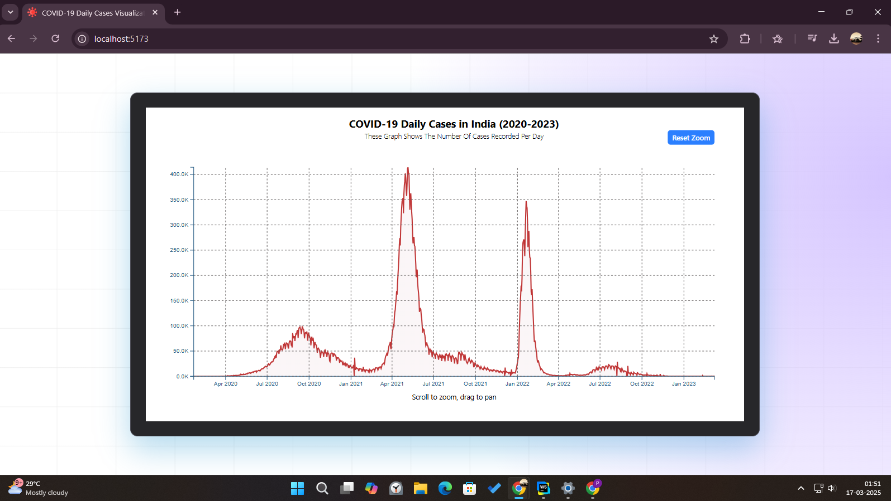
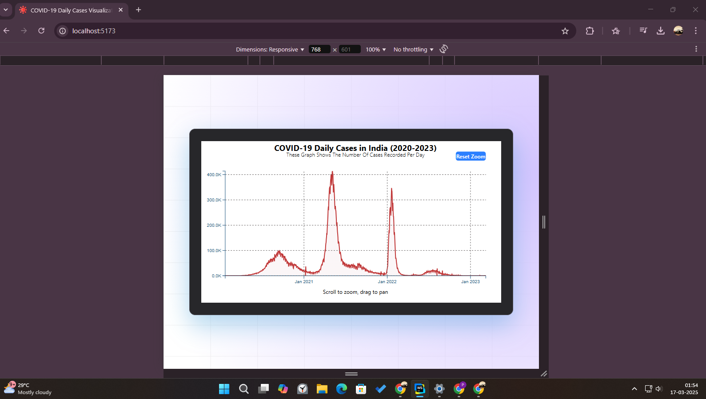

# 🌟 COVID-19 Daily Cases Line Chart (India) 📊

Welcome to the **COVID-19 Daily Cases Line Chart (India)** project! This interactive data visualization app 📈 is built with **React & D3.js** and provides an insightful view of daily COVID-19 cases in India over time.

---

## ✨ Features
- 🚀 **Interactive Line Chart:** Zoom, pan, and dynamically resize the chart.
- 🔍 **Tooltips:** Hover over data points to view exact values.
- 📅 **Date Handling:** Properly formatted x-axis representing dates.
- 🎨 **Custom Styling:** Smooth grid lines and intuitive UI.
- 🌐 **Real Data Fetching:** Data is fetched using `axios` for live updates.
- ⚛️ **State Management:** `useState` is used for managing component states effectively.
- 🔄 **Side Effects Handling:** `useEffect` is used for fetching data and setting up D3.js components on component mount and updates.
- 🖋️ **SVG Rendering:** The chart is created using **SVG elements**, leveraging **D3.js** for DOM manipulation and data binding. Canvas/WebGL implementations are not used.


---

## 📂 Project Structure

📦 Project Root

┣ 📂 src
┃ ┣ 📂 assets
┃ ┣ 📂 Components
┃ ┃ ┗ 📄 CovidGraph.jsx
┃ ┣ 📄 App.css
┃ ┣ 📄 App.jsx
┃ ┣ 📄 index.css
┃ ┗ 📄 main.jsx


---

## 📸 Screenshots
### 🖼️ Sample Line Chart


### 🖼️ Responsive Design


---

## 🔧 Installation & Usage

1. **Clone the repository**
```bash
git clone https://github.com/deep-priyo/Covid19PlotUsing_D3.git
```

2. **Clone the repository**
```bash
cd Covid19PlotUsing_D3
```
3. **Install dependencies**
```bash
npm install
```
4. **Run the app**
```bash
npm run dev
```

## 📌 Tech Stack
- Frontend: React
- Visualization: D3.js
- Styling: Tailwind CSS